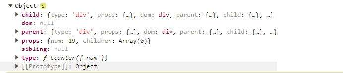

# 统一提交

因为现在的代码是每次完成一个节点创建后就进行添加,如果渲染了几个节点后,下个空闲周期很晚,则会出现显然几个元素的情况,这个时候就可以使用统一提交的方案避免该问题，这里涉及到两个关键点

- 根节点：也就是初始任务
- 统一挂载的时机：当没有任务的时候【`!!nextWorkOfUnit === false`】

## 分析

我们的问题是将 dom 一次性渲染到页面上，所以有两种方式解决该问题

- 方法一：所有节点都不挂载，后期通过链表进行挂载
- 方法二：除了需要挂载到根节点以外的所有节点都挂载，最后挂载到根节点【root 下 app: 其他节点都进行挂载，最后将 app 挂载到 root 上】

### 方法一

1. 记录根节点

```js
let nextWorkOfUnit = null;
let root = null;
const render = (el, container) => {
  root = nextWorkOfUnit = {
    dom: container,
    props: {
      children: [el],
    },
  };
};
```

2. 统一挂载节点

```js
function commitRoot() {
  commitWork(root.child);
  root = null;
}

function commitWork(fiber) {
  if (!fiber) return;
  fiberParent.dom?.append(fiber.dom);
  commitWork(fiber.child);
  commitWork(fiber.sibling);
}

function workLoop(deadline) {
  // 是否进行让步
  // ...
  // 渲染完成了,统一提交到root节点上
  if (!nextWorkOfUnit && root) {
    commitRoot();
  }

  requestIdleCallback(workLoop);
}
```

> 这里在最后记得清理掉 `root`，然后判断 `root` 有值才需要进行挂载，挂载操作也很简单，就是用`父级 dom` 添加`自己的 dom`

3. 需要先去掉`performWorkOfUnit`方法的节点挂载操作

到这里我们的统一提交完成了，剩下的事情就是让其能渲染 Function 组件

# Function 组件渲染

## 分析

我们最需要知道的是 jsx 会将 Function 组件解析成什么？所以我们可以打印一下信息

```jsx
import React from "./core/React.js";

function Counter({ num }) {
  return (
    <div>
      测试一下num:{num}
      <div>测试一下3</div>
    </div>
  );
}

const App = (
  <div id="app">
    hello world
    <Counter num={19}></Counter>
  </div>
);
export default App;
```



> 通过打印我们可以看出`jsx`解析`function组件`的结构
>
> - type: 为 function
> - props: 没有变化

我们在看看 jsx 给的这个 function 执行后得到的是什么内容？

```json
{
  "type": "div",
  "props": {
    "children": [
      {
        "type": "TEXT_ELEMENT",
        "props": {
          "nodeValue": "测试一下num:",
          "children": []
        }
      },
      {
        "type": "TEXT_ELEMENT",
        "props": {
          "nodeValue": 9,
          "children": []
        }
      },
      {
        "type": "div",
        "props": {
          "children": [
            {
              "type": "TEXT_ELEMENT",
              "props": {
                "nodeValue": "测试一下3",
                "children": []
              }
            }
          ]
        }
      }
    ]
  }
}
```

我们发现,执行该函数后面,我们会得到一个虚拟 dom 对象,而且这个对象和我们前面的虚拟 dom 对象是完全一样的,我们只要得到了这个虚拟 dom 对象,然后按照以前处理虚拟 dom 对象一样对其处理即可.

## 实现

- 执行 type 函数,获取虚拟 dom 对象
- 为其确定关系 parent sibling child
- 返回新任务

> 因为这个节点是一个函数,所以不需要进行 dom 创建的

```js
function initChildren(fiber, children) {
  // 确定关系 parent sibling child
  let prevChild = null;
  children.forEach((child, index) => {
    const newFiber = {
      type: child.type,
      props: child.props,
      dom: null,
      parent: fiber,
      child: null,
      sibling: null,
    };

    if (index === 0) fiber.child = newFiber;
    else prevChild.sibling = newFiber;

    prevChild = newFiber;
  });
}

function performWorkOfUnit(fiber) {
  // 创建元素
  const { type, props, dom } = fiber;
  const isFunctionComponent = typeof type === "function";
  if (!isFunctionComponent) {
    if (!dom) {
      // 设置fiber的dom
      const ele = (fiber.dom = createDom(type));
      updateProps(ele, props);
    }
  }
  const children = isFunctionComponent ? [type(props)] : props.children;
  initChildren(fiber, children);

  // 返回新任务
  // 有子节点就返回子节点
  if (fiber.child) return fiber.child;
  // 如果没有子节点就返回兄弟节点
  if (fiber.sibling) return fiber.sibling;
  // 如果没有兄弟节点就返回父节点的兄弟节点
  return fiber.parent?.sibling;
}
```

- 如果是 function 组件,就不需要创建 dom 节点和赋值
- 执行 type 函数,并将返回的结果处理成为统一格式去确定关系【对 initChildren 进行了简单的处理】
- 返回新任务

> 这里因为有参数并且是为 number，需要注意一下我们需要渲染 number 类型,我们需要将其归类到`createTextNode`中

```js
const createElement = (type, props, ...children) => {
  return {
    type: type,
    props: {
      ...props,
      children: children.map((item) =>
        typeof item === "string" || typeof item === "number"
          ? createTextNode(item)
          : item
      ),
    },
  };
};
```

## 问题

上面的实现如果碰到层级深了，就会出现问题，这个时候我们需要对`performWorkOfUnit`的返回和`commitWork`的父级 dom 节点进行查找

**performWorkOfUnit**

```js
function performWorkOfUnit(fiber) {
  // 创建元素
  const { type, props, dom } = fiber;
  const isFunctionComponent = typeof type === "function";
  isFunctionComponent && console.dir(type(props));
  if (!isFunctionComponent) {
    if (!dom) {
      // 设置fiber的dom
      const ele = (fiber.dom = createDom(type));
      updateProps(ele, props);
    }
  }
  const children = isFunctionComponent ? [type(props)] : props.children;
  initChildren(fiber, children);

  // 返回新任务
  // 有子节点就返回子节点
  if (fiber.child) return fiber.child;
  // 如果没有子节点就返回兄弟节点
  if (fiber.sibling) return fiber.sibling;
  // 如果没有兄弟节点就返回父节点的兄弟节点
  let nextFiber = fiber.parent;
  while (nextFiber) {
    if (nextFiber.sibling) return nextFiber.sibling;

    nextFiber = nextFiber.parent;
  }
}
```

> 这里如果发现父节点没有兄弟节点，那么就找到上面有兄弟节点的那个父节点，然后返回父节点的兄弟节点。

**commitWork**

```js
function commitWork(fiber) {
  if (!fiber) return;
  let fiberParent = fiber.parent;
  while (!fiberParent.dom) {
    fiberParent = fiberParent.parent;
  }
  if (fiber.dom) {
    fiberParent.dom?.append(fiber.dom);
  }
  commitWork(fiber.child);
  commitWork(fiber.sibling);
}
```

> 如果父节点没有 dom 属性，那么就找父节点的父节点，直到找到为止。同时没有 dom 属性，就不要`append`，不然会显示`null`

## 重构

```js
function updateFunctionComponent(fiber) {
  const { type, props } = fiber;
  const children = [type(props)];
  initChildren(fiber, children);
}

function updateHostComponent(fiber) {
  const { type, props, dom } = fiber;
  if (!dom) {
    // 设置fiber的dom
    const ele = (fiber.dom = createDom(type));
    updateProps(ele, props);
  }
  const children = props.children;
  initChildren(fiber, children);
}

function performWorkOfUnit(fiber) {
  // 创建元素
  const isFunctionComponent = typeof fiber.type === "function";

  if (isFunctionComponent) {
    updateFunctionComponent(fiber);
  } else {
    updateHostComponent(fiber);
  }

  // 。。。返回新任务
}
```

将 function 组件和普通节点区分开，分别处理。是代码单一、可读性高。
