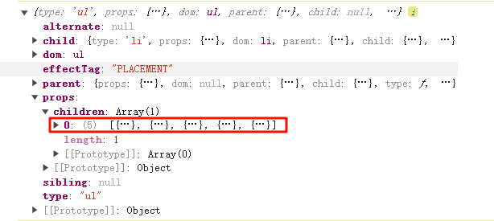

# 问题优化 min react

## 问题一： 使用 Array.map 无法渲染列表

```jsx
function App() {
  const list = [1, 2, 3, 4, 5];

  return (
    <ul>
      {list.map((item) => (
        <li>{item}</li>
      ))}
    </ul>
  );
}
```

我们打印一下 fiber 内容,我们发现 children 里面是一个数组，而不是一个对象，所以我们可以将 children 进行拍平


```js
function updateHostComponent(fiber) {
  if (!fiber.dom) {
    // 设置fiber的dom
    const ele = (fiber.dom = createDom(fiber.type));
    updateProps(ele, fiber.props, fiber.alternate?.props);
  }
  console.log(fiber);
  const children = fiber.props.children.flat(Infinity);
  reconcileChildren(fiber, children);
}
```

> 这里使用 flat 对数组进行拍平，我们也只需要在这一个地方需要，因为`updateFunctionComponent`会生成一个对象，然后我们改成数组传入`reconcileChildren`,所以不存在这个问题

## 问题二：在 useEffect 中进行 setState 无法更新

```jsx
import React from "./core/React.js";

const list = [1, 2, 3, 4, 5, 6, 7, 8, 9, 10];
export default function App() {
  const [isShowOdd, setIsShowOdd] = React.useState(false);

  const [renderList, setRenderList] = React.useState([...list]);

  function handleClick() {
    setIsShowOdd(!isShowOdd);
  }

  React.useEffect(() => {
    const lists = list.filter((item) => (isShowOdd ? item % 2 === 1 : true));
    setRenderList(lists);
  }, [isShowOdd]);

  return (
    <div>
      <button onClick={handleClick}>显示奇数</button>

      <ul>
        {renderList.map((item) => (
          <li>{item}</li>
        ))}
      </ul>
    </div>
  );
}
```

**分析**

在该案例中，我们点击显示奇数的时候会无法改变，我们先了解一下流程

1. 我们点击按钮，`setIsShowOdd` 触发更新渲染【`wipRoot = 。。。`】
2. 更新完成后，`commitRoot` 执行
   1. `commitWork`: 挂载节点
   2. `commitEffects`: 处理 `Effect` 函数
      - `setRenderList` 触发更新【`wipRoot = 。。。`】
   3. `wipRoot = null`
3. 下一个空闲时机：`!nextWorkOfUnit && wipRoot`，拥有`nextWorkOfUnit`但是`wipRoot === null`无法进入`commitRoot`,无法挂载节点

**解决方案**

通过上面的分析，我们有两个方向

1. 修改`commitEffects`时机为`wipRoot = null`之后，我们可以使用`currentRoot`节点进行`useEffect`的遍历节点

```js
function commitEffects() {
  // -----省略----

  runCleanup(currentRoot);
  run(currentRoot);
}

function commitRoot() {
  delimiters.map(commitDeletion);
  commitWork(wipRoot.child);
  currentRoot = wipRoot;
  wipRoot = null;
  commitEffects();
  delimiters = [];
}
```

2. 竟然是因为 wipRoot 没有值导致的，那么我们可以考虑一下 commitRoot 的调用判断

```js
function workLoop(deadline) {
  // 是否进行让步
  let shouldYield = false;

  while (!shouldYield && nextWorkOfUnit) {
    nextWorkOfUnit = performWorkOfUnit(nextWorkOfUnit);

    if (wipRoot?.sibling?.type === nextWorkOfUnit?.type) {
      nextWorkOfUnit = undefined;
    }

    shouldYield = deadline.timeRemaining() < 1;
  }

  // 渲染完成了,统一提交到root节点上
  if (!nextWorkOfUnit && wipRoot) {
    commitRoot();

    if (nextWorkOfUnit) {
      wipRoot = currentRoot;
    }
  }

  requestIdleCallback(workLoop);
}
```

> 我们调用完成`commitRoot`后，我们就再检测一下`nextWorkOfUnit`是否为空，不为空则说明还有任务没有执行完，所以我们将`wipRoot`赋值给`currentRoot`，那么下次任务结束后还是会进入`commitRoot`，挂载节点
