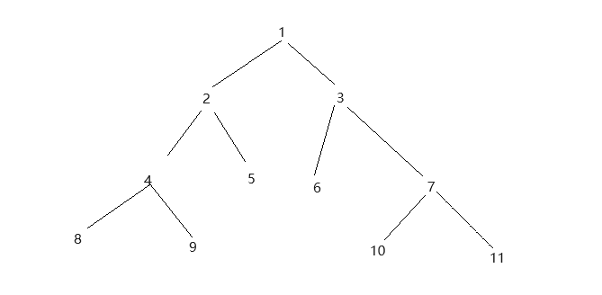

# 任务调度器

因为前面说的递归树形结构,一次渲染太多的内容可能会导致页面卡顿,所以我们要设计一个任务调度器,来控制渲染的时机,保证页面的流畅度

## requestIdleCallback

`requestIdleCallback`方法能在浏览器空闲时执行回调函数,并且会返回一个`IdleDeadline`对象,该对象有以下两个属性:

- `timeRemaining()`: 返回浏览器剩余时间,单位毫秒
- `didTimeout`: 返回一个布尔值,表示是否超时

[MDN 文档](https://developer.mozilla.org/zh-CN/docs/Web/API/Window/requestIdleCallback#callback)

我们可以通过`timeRemaining()`方法获取到浏览器空闲时间,然后在空闲时间里执行我们的任务.

## 实现

```js
function workLoop(deadline) {
  // 是否进行让步
  let shouldYield = false;

  while (!shouldYield) {
    console.log("进行事件");
    shouldYield = deadline.timeRemaining() < 1;
  }

  requestIdleCallback(workLoop);
}

requestIdleCallback(workLoop);
```

- 通过不断调用 requestIdleCallback，保证我们的代码在浏览器空闲的时候执行。
- 判断空闲时间 > 1ms，则表示浏览器空闲，可以进行任务，否则则表示浏览器忙，需要让步。

# 实现 Fiber 架构

## 分析

我们上面完成了一个任务调度器,但是这个调度器需要一个一个的任务,现在我们的虚拟 dom 节点还是一个树状数据,无法支持调度器的调用,所以我们需要将虚拟 dom 节点转换为一个链表,然后进行调度。

转成链表需要注意一下几点:

- 节点的渲染顺序
  - 先渲染父节点,然后渲染子节点
  - 没有子节点, 就渲染兄弟节点
  - 兄弟节点渲染完成后, 最后渲染父节点的兄弟节点

解析:


- 先渲染父节点: 1
- 渲染子节点: 2
- 渲染 2 的子节点: 4
- 渲染 4 的子节点: 8
- 发现 8 没有子节点, 渲染 8 的兄弟节点: 9
- 发现 9 没有子节点, 渲染 9 父节点【4】的兄弟节点: 5
- 发现 5 没有子节点, 渲染 5 父节点【2】的兄弟节点: 3
- 渲染 3 的子节点: 6
- 发现 6 没有子节点, 渲染 6 的兄弟节点: 7
- 渲染 7 的子节点: 10
- 发现 10 没有子节点, 渲染 10 的兄弟节点: 11

按上面的分析，我们有两个方案：

1. 直接将树形结构转化为链表结构后进行渲染【先循环树构建关系，然后使用链表进行循环】
2. 我们可以直接进行渲染，一边构建关系，一边进行渲染【只需要循环一边树，即可】

我们很明显的能感觉到边渲染边构建关系是最好的，因为不需要提前遍历一遍树进行转化，按照第二种方案的话，我们就要在当前节点记录以下内容

- `parent`: 当前节点的父节点
- `sibling`: 当前节点的兄弟节点
- `children`: 当前节点的子节点

## 实现

### 结合任务调度器

首先让我们的任务调度器接手我们的渲染任务

```js
let nextWorkOfUnit = null;
function workLoop(deadline) {
  // 是否进行让步
  let shouldYield = false;

  while (!shouldYield && nextWorkOfUnit) {
    nextWorkOfUnit = performWorkOfUnit(nextWorkOfUnit);

    shouldYield = deadline.timeRemaining() < 1;
  }

  requestIdleCallback(workLoop);
}

requestIdleCallback(workLoop);
```

- `nextWorkOfUnit`: 定义一个全局变量作为当前正在执行的任务
- `performWorkOfUnit`: 执行任务, 并返回下一个任务

### 实现 performWorkOfUnit

这个函数为实现一个任务,实现一个任务需要做一下几件事

- 创建`dom`, 设置属性， 并添加到父节点上
- 对子节点进行 `fiber` 转化【转为链表形式，确定`parent`, `sibling`, `child`】
- 返回下一个任务【逻辑如上：分析 - 解析】

> 根据以上的三点分析，我们可以确定一个`fiber`需要以下属性
>
> - `type`: 当前节点的类型
> - `props`: 参数
> - `dom`: 当前节点对应的`真实 DOM`
> - `parent`: 当前节点的父节点
> - `sibling`: 当前节点的兄弟节点
> - `children`: 当前节点的子节点

#### 创建节点

```js
// 创建节点
function createDom(type) {
  return type === "TEXT_ELEMENT"
    ? document.createTextNode("")
    : document.createElement(type);
}

function updateProps(dom, props) {
  // 设置props
  Object.keys(props).forEach((key) => {
    if (key !== "children") {
      dom[key] = props[key];
    }
  });
}

function performWorkOfUnit(fiber) {
  const { type, props, dom } = fiber;
  if (!dom) {
    const ele = (fiber.dom = createDom(type));
    updateProps(ele, props);
    fiber.parent.dom.append(ele);
  }
}
```

> 这里创建元素，并将元素绑定到 `fiber的dom属性` 上，就是为了将后续子节点添加到`dom树`上

#### 确定子级关系

```js
function initChildren(fiber) {
  let prevChild = null;
  fiber.props.children.forEach((child, index) => {
    const newFiber = {
      type: child.type,
      props: child.props,
      dom: null,
      parent: fiber,
      child: null,
      sibling: null,
    };

    if (index === 0) fiber.child = newFiber;
    else prevChild.sibling = newFiber;

    prevChild = newFiber;
  });
}
```

- 如果为`children`第一个元素，那么就是`fiber.child`
- 如果不是，那么就是上一个`fiber`的`sibling`
- 这里需要更新一下`prevChild`
- `type`: 和 `child` 的 `type` 相同
- `props`: 和 `child` 的 `props` 相同
- `dom`: 先设置为 `null`，因为这个时候还没有渲染
- `parent`: 就是当前执行的`fiber`

#### 返回下一个 fiber

```js
// 有子节点就返回子节点
if (fiber.child) return fiber.child;
// 如果没有子节点就返回兄弟节点
if (fiber.sibling) return fiber.sibling;
// 如果没有兄弟节点就返回父节点的子节点
return fiber.parent?.sibling;
```

#### 最终的 performWorkOfUnit

```js
function performWorkOfUnit(fiber) {
  const { type, props, dom } = fiber;
  const ele = (fiber.dom = createDom(type));
  updateProps(ele, props);
  fiber.parent.dom.append(ele);

  initChildren(fiber);

  if (fiber.child) return fiber.child;
  if (fiber.sibling) return fiber.sibling;
  return fiber.parent?.sibling;
}
```

#### 将 render 函数与 performWorkOfUnit 函数进行合并

```js
const render = (App, container) => {
  nextWorkOfUnit = {
    dom: container,
    props: {
      children: [App],
    },
  };
};
```

> 这里将渲染任务作为一个 `fiber` 节点，并赋值给 `nextWorkOfUnit`，然后等待`performWorkOfUnit` 函数的调用，进行渲染。
> 时机：浏览器空闲的时候

#### 问题：

但是这里有一个问题，如果是根节点，这个时候 dom 是有数据的，不需要创建并赋值，所以需要更改一下创建 dom 的逻辑

```js
function performWorkOfUnit(fiber) {
  const { type, props, dom } = fiber;
  // 判断dom是否有内容，没有内容就创建dom
  if (!dom) {
    // 设置fiber的dom
    const ele = (fiber.dom = createDom(type));
    updateProps(ele, props);
    // 添加到dom树中
    fiber.parent.dom.append(ele);
  }

  initChildren(fiber);

  // 返回新任务
  // 有子节点就返回子节点
  if (fiber.child) return fiber.child;
  // 如果没有子节点就返回兄弟节点
  if (fiber.sibling) return fiber.sibling;
  // 如果没有兄弟节点就返回父节点的子节点
  return fiber.parent?.sibling;
}
```

## 提问

`requestIdleCallback`是在浏览器空闲时调用的，如果有某几个任务没有闲置时间，那么就会导致页面加载部分，这个问题该怎么解决呢？

答：在`requestIdleCallback`调用的时候可以设置一个`options`,作用是告诉浏览器，如果浏览器空闲时间不够，就强制调用`requestIdleCallback`。可以通过该设置解决一直没有加载的问题
